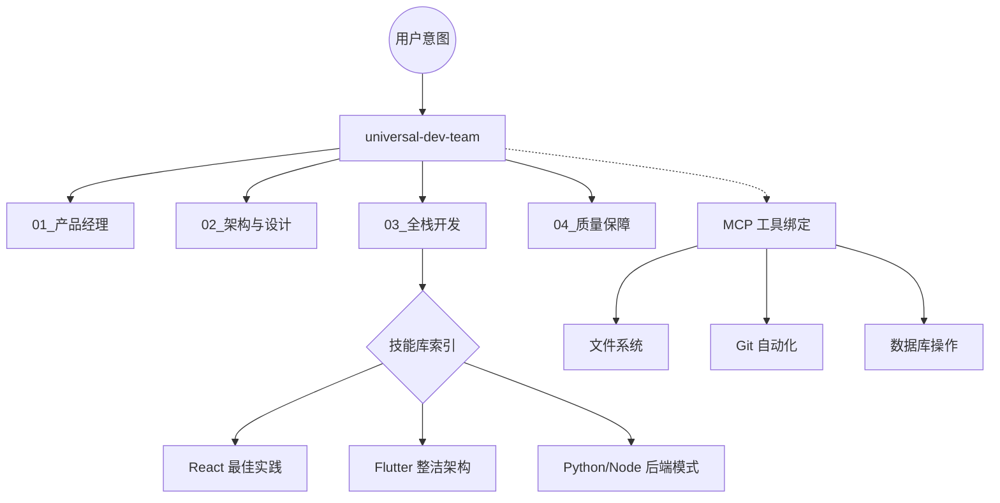

# 🚀 Trae Skills Engine: 工业级 AI 协作技能库

欢迎来到 **Trae Skills Engine**！这是一个为 Trae IDE 量身定制的“大脑插件集”。它不只是一堆文档，而是一套**可执行、可移植、可编排**的工业级软件开发工作流。

---

## �️ 架构愿景 (Architecture Vision)

我们通过“技能原子化”与“角色智能体化”，将复杂的软件工程拆解为 AI 可理解、可执行的标准化动作。

---

## 🌟 核心特性 (Key Features)

### 1. 🤖 智能体增强 (Agentic Enhancement)
每个核心 Skill 都配有 `AGENTS.md`。你可以直接在 Trae 中创建 Agent 并粘贴提示词，配合 **MCP 工具** 实现从“纸上谈兵”到“自动执行”的跨越。

### 2. 🛡️ 工业级标准 (Industry Standards)
集成 Vercel 设计规范、Flutter 整洁架构、FastAPI 异步模式等前沿技术标准。

### 3. 🧩 乐高式扩展 (Lego-like Extensibility)
使用 `99_Meta_SkillCreator` 几秒钟内即可固化你的私人开发模式。

---

## 📖 快速开始 (Quick Start)

我们准备了四份**黄金指南**，助你快速上手：

| 指南名称 | 适用场景 | 核心价值 |
| :--- | :--- | :--- |
| **[自然语言唤醒指南](./自然语言唤醒指南.md)** | **[新手必看]** | 教你如何用一句话激活整个开发团队。 |
| **[全栈开发最佳实践](./全栈开发最佳实践指南.md)** | **[项目实战]** | 工业级 Web 项目从需求到交付的全流程串联。 |
| **[移动端开发最佳实践](./移动端开发最佳实践指南.md)** | **[Flutter/原生]** | 深度适配移动端特有场景（离线、性能、安全）。 |
| **[自动化配置最佳实践](./自动化配置最佳实践.md)** | **[高级进阶]** | 配置即代码，让 AI 完美遵循你的个人/团队偏好。 |

---

## 📚 技能全景图 (Skill Catalog)

### 💡 01-02. 需求与设计
- **[产品头脑风暴](.trae/Skills/01_ProductManager_Brainstorming/SKILL.md)**: 拒绝模糊需求，深度挖掘痛点。
- **[API 设计专家](.trae/Skills/02_Architect_APIDesign/SKILL.md)**: REST/GraphQL 契约优先开发。
- **[Web 设计规范](.trae/Skills/02_Designer_WebGuidelines/SKILL.md)**: 让 AI 也能写出 Vercel 级别的精致 UI。

### 💻 03-05. 开发与运维
- **[React 性能大师](.trae/Skills/03_Developer_ReactBestPractices/SKILL.md)**: 极致的渲染优化与状态管理。
- **[Flutter 专家](.trae/Skills/03_Mobile_Flutter/SKILL.md)**: 整洁架构落地，一套代码丝滑双端。
- **[后端与数据库](.trae/Skills/05_Backend_Database/SKILL.md)**: SQL 优化、异步模式与 MCP Server 构建。
- **[GitOps 工作流](.trae/Skills/05_DevOps_GitOps/SKILL.md)**: 提交即部署，自动化运维闭环。

### 📂 06-08. 垂直领域
- **[办公自动化](.trae/Skills/06_Office_Docx/SKILL.md)**: 深度操作 Word/Excel/PDF。
- **[安全审计](.trae/Skills/07_Security_Specialist/SKILL.md)**: GDPR 合规与 Auth 安全扫描。
- **[AI 工程化](.trae/Skills/08_AI_Engineer/SKILL.md)**: RAG 架构与 Agent 编排。

---

## 🤝 贡献与反馈

本库深度集成了 **Anthropic**、**Vercel** 及 **Composio** 的开源精华。如果你有更好的最佳实践，欢迎通过 [99_Meta_SkillCreator](.trae/Skills/99_Meta_SkillCreator/SKILL.md) 提交你的 PR！

> **提示**: 别忘了在 Trae 设置中通过 [Trae_Skills_使用指南.md](./Trae_Skills_使用指南.md) 配置你的专属 Agent！
