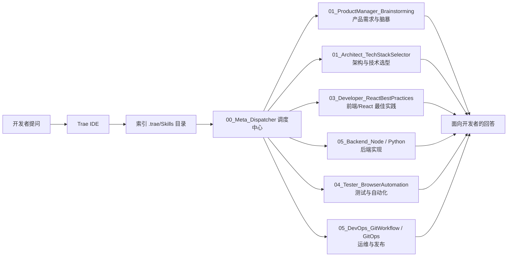
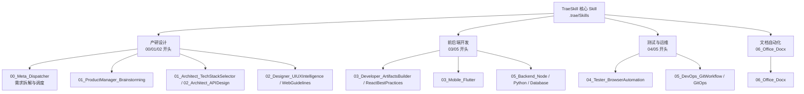

# TraeSkill

<div align="center">


**专为 Trae IDE 打造的原生 AI 技能与上下文增强库**

[English](README_EN.md) | [中文](README.md)

</div>

---

> 🚀 **升级提示 (Upgrade Notice)**
>
> 寻找更通用的版本？请访问我们全新的 **[AgenticFlow-Skills](https://github.com/your-username/agenticflow-skills)** 项目。
> AgenticFlow-Skills 继承了 TraeSkill 的核心能力，并扩展了对 **Cursor**, **VS Code**, **Windsurf** 的支持，是新一代的 **标准化 AI 技能库 (AI Skill Library)**。

---

## 📖 项目简介 (What is TraeSkill?)

**TraeSkill** 是一个标准化的 **Prompt Context 与 AI 技能集合**，专门为 **Trae IDE 的 `.trae/Skills` 机制** 设计。

它的目标是：
- 把「行业最佳实践」沉淀为可复用的 Skill（Markdown 规则文件）
- 让 AI 在 Trae 中不再是“通用聊天”，而是：
  - 会写 PRD 的产品经理
  - 懂架构与技术选型的架构师
  - 熟悉 React/Flutter 性能优化的大前端工程师
  - 懂自动化测试与 DevOps 的质量与运维专家

**💡 快速查阅**  
- **[常用开发技能及场景指南](./开发常用技能及场景指南.md)**：推荐初学者优先阅读，快速掌握各阶段技能用法。
- **[自然语言唤醒指南](./自然语言唤醒指南.md)**：学习如何通过自然语言高效触发专家角色。
- **[TraeSkill 从 0 到 1 开发蓝图 (PLAN.md)](../PLAN.md)**：了解如何用本仓库支撑完整的研发流程。

---

## 🧩 目录与核心模块 (Structure & Modules)

仓库的核心在于 `.trae/Skills` 目录，每个子目录代表一个专业领域的 Skill 套件，例如：

- `00_Meta_Dispatcher`：任务调度与蓝图生成中枢，负责解析需求、拆解阶段并路由到其他 Skill。
- `01_ProductManager_Brainstorming`：产品需求梳理、用户故事拆解、竞品分析与 PRD 草案生成。
- `01_Architect_TechStackSelector`：技术栈选型评估（性能、复杂度、团队熟悉度等）、方案对比与推荐。
- `02_Architect_APIDesign`：REST / GraphQL API 设计规范、资源建模与接口契约梳理。
- `02_Designer_UIUXIntelligence`：UI/UX 智能知识库：组件风格、配色、排版、交互模式、UX 准则等。
- `02_Designer_WebGuidelines`：Web 可访问性、响应式设计与通用前端 UI 规范审查。
- `03_Developer_ArtifactsBuilder`：用于在 Trae 中快速生成前端 Artifact（如 React/Tailwind/shadcn UI 代码片段）。
- `03_Developer_ReactBestPractices`：React/Next.js 性能与可维护性最佳实践：渲染优化、状态管理、数据获取模式等。
- `03_Mobile_Flutter`：Flutter 架构（整洁架构、分层设计）、状态管理与性能调优相关参考与模板。
- `04_Tester_BrowserAutomation`：基于浏览器自动化的端到端测试思路与脚本示例。
- `05_Backend_Node` / `05_Backend_Python`：后端工程实践：接口层设计、异步编程模式、性能优化与测试策略。
- `05_Backend_Database`：数据库建模、索引设计、SQL 优化模式与迁移策略。
- `05_DevOps_GitWorkflow` / `05_DevOps_GitOps`：Git 分支模型、CI/CD 思路、GitOps 与 Kubernetes 相关实践。
- `06_Office_Docx`：面向文档自动化处理（docx/ooxml）的技能与参考规范。

你可以将其理解为：这是一个按“角色/环节”组织的 AI 专家团队，每个目录就是一位长期在线的专家顾问。

---

## 🗺 结构示意图 (Architecture Diagrams)

### TraeSkill 在 Trae IDE 中的工作流



### Skill 分类概览（按生命周期分组）



---

## 🌟 能力覆盖 (Core Capabilities)

TraeSkill 覆盖了从“想做什么”到“如何上线”的完整软件开发生命周期：

### 🧠 Product & Design (产研设计)
- **Product Manager**：PRD 生成、需求澄清、范围界定、用户故事拆解。
- **UI/UX Designer**：设计系统、组件化思维、配色与排版、Web 体验准则。

### 🏗 Architecture & Backend (架构与后端)
- **System Architect**：系统边界划分、领域建模、接口与数据库的协同设计。
- **Backend Engineering**：Node.js / Python 服务端模式、数据库迁移、SQL 优化、异步与性能调优。

### 💻 Frontend & Mobile (大前端)
- **React Specialist**：渲染性能优化、Hooks 最佳实践、Server Components / Data Fetching 模式。
- **Flutter Expert**：分层架构、状态管理、性能分析与调优策略。

### 🛡 Quality & Operations (质量与运维)
- **Testing Automation**：浏览器自动化测试、回归测试脚本思路、端到端验收。
- **Security / DevSecOps**：安全需求提取与代码审计规则。
- **DevOps / GitOps**：Git 工作流、CI/CD 思路、声明式部署与 GitOps 实践。

---

## 🔧 工作原理 (How it Works)

TraeSkill 利用了 Trae IDE 的原生 **Skills** 特性：

- 所有规则文件均位于 `.trae/Skills` 目录下，以 Markdown 形式组织。
- 当你在 Trae 中打开此项目，或将其中某些 Skill 目录复制到你自己的项目时：
  - Trae 的 AI Agent 会自动索引这些 Skill 文件；
  - 当你提问相关问题（如“优化这个 React 组件”）时，会优先查阅对应规则（如 `03_Developer_ReactBestPractices`）；
  - 回答会自动带上这些领域知识，而无需你记住任何具体文件名。

你可以把它理解为：给 AI 预先塞了一整套“团队开发手册 + 经验库”，并由 Trae 帮你在对话时自动检索与应用。

---

## 🚀 使用方式 (Quick Start in Trae)

1. **克隆仓库**
   ```bash
   git clone https://github.com/your-username/TraeSkill.git
   ```
2. **在 Trae 中打开**
   - 直接使用 Trae 打开 `TraeSkill` 目录；或
   - 将 `.trae/Skills` 目录复制到你自己的项目根目录下。
3. **开始对话**
   - 示例问题：
     - 「帮我设计一个用户登录系统的 API」
     - 「检查这段 React 代码的渲染性能」
     - 「根据这个原型，给我一份简单的 PRD」
   - AI 将自动调用合适的 Skill（例如架构设计、React 最佳实践、产品脑暴等）。
4. **与 AgenticFlow-Skills 配合**
   - 如果你在其他编辑器中使用 **AgenticFlow-Skills**，可以在其中复用同名 Skill；
   - TraeSkill 则是针对 Trae 使用场景进行的定制版，更适合作为 Trae 中的“原生技能库”。

---

## 🔍 关键词 (Keywords)

Trae IDE, AI Skills, Prompt Engineering, Context Management, React Best Practices, Flutter Architecture, Automated Testing, System Design, GitOps, AI Agent.

---

## 📄 许可证 (License)

MIT License
